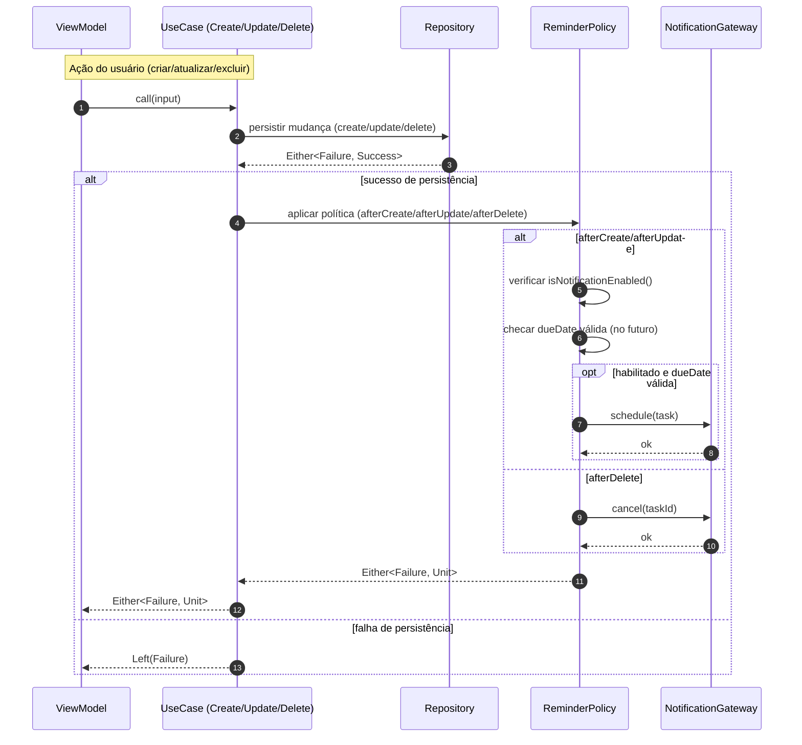
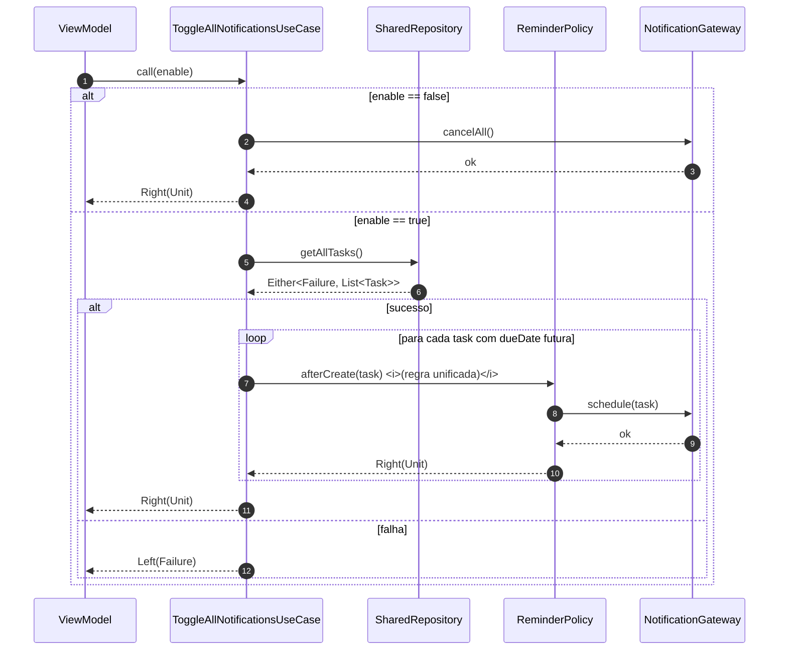

# 📝 IDez Test App

Este projeto foi desenvolvido como parte de um desafio técnico.  
O objetivo é criar um **gerenciador de tarefas** simples, mas com **arquitetura robusta e escalável**, que suporte desde poucos até milhares de itens sem perda de performance.

---

## 🚀 Tecnologias usadas
- **Flutter** (UI + lógica)
- **MobX** (gerência de estado reativa)
- **Dartz** (para lidar com `Either` e falhas)
- **GetIt** (injeção de dependência)
- **Armazenamento local em JSON** (Key-Value Store)

---

## 📂 Estrutura de pastas

```plaintext
src/
  core/
    di/              -> injeção de dependências
    state/           -> estados genéricos (Success, Error, Loading, etc.)
    theme/           -> estilos globais
    mixin/           -> mixins utilitários (ex: exclusão pendente)
  modules/
    shared/          -> entidades, repositórios e casos de uso reutilizados
    board/           -> telas de listagem e filtros
    task/            -> criação e edição de tarefas
    categories/      -> categorias das tarefas
```

### Decisão de design
- `shared` guarda o que é comum a vários módulos (tasks, categorias, use cases básicos).  
- Cada `module` concentra sua **UI + ViewModel + regras específicas**, isolando responsabilidades.  
- Isso facilita **escala do projeto** sem duplicação desnecessária.

---

## 🧭 E por que essa arquitetura?

Eu já vi muita empresa organizando microapps com dependência cruzada e várias gambiarras só pra “separar”. Eu não quis seguir esse modelo.  
Pra mim:

- **Core ≠ dependência obrigatória das features** → prefiro que seja infra e utilitário, não algo que quebre se eu exportar uma feature.
- **Reuso > isolamento extremo** → `TaskEntity`, `CategoryEntity` e `SharedRepository` vivem em `shared/` porque são úteis em várias telas. Não faz sentido duplicar só pra seguir microapp “bonitinho”.
- **Escalabilidade de verdade** → a arquitetura atual já é suficiente pra suportar **um app grande** sem travar ou virar um monolito confuso.

### Arquitetura e Casos de Uso

O projeto segue **Clean Architecture + MVVM**.  
Cada caso de uso (use case) é **atômico**, responsável por uma única regra de negócio (criar, atualizar, excluir, listar etc.).

Para **evitar duplicação** e manter a lógica de lembretes consistente (agendar, cancelar, reativar), criamos um **serviço de domínio** (`ReminderPolicy`) que é utilizado internamente pelos casos de uso.  

Dessa forma:
- A UI (View/ViewModel) não conhece detalhes de notificações.
- A lógica de quando criar, atualizar ou remover lembretes está centralizada.
- Cumpre o **princípio da responsabilidade única**: cada caso de uso resolve um objetivo específico, mas pode delegar regras transversais para serviços.

---

### Estrutura resumida

- **Gateways (Domínio)**  
  Interfaces como `NotificationGateway` expõem apenas:
  ```dart
  Future<void> schedule(...);
  Future<void> cancel(int id);
  Future<void> cancelAll();
  ```
  Assim o domínio não depende de libs concretas (ex: `flutter_local_notifications`).

- **Infra (Adaptadores)**  
  Implementações concretas (ex.: `FlutterLocalNotificationsGateway`).

- **Serviços de domínio**  
  - `ReminderPolicy`: concentra regras de agendamento/cancelamento, reutilizada pelos casos de uso.

- **Casos de uso**  
  - `CreateTaskUseCase` → persiste tarefa e aplica `ReminderPolicy`.
  - `UpdateTaskUseCase` → atualiza tarefa e aplica `ReminderPolicy`.
  - `DeleteTaskUseCase` → remove tarefa e aplica `ReminderPolicy`.
  - `ToggleAllNotificationsUseCase` → ativa/desativa todas notificações globais.

---

### Fluxo prático (criar tarefa)

1. Usuário cria a tarefa na UI.  
2. O ViewModel chama `CreateTaskUseCase`.  
3. O caso de uso persiste a tarefa e consulta a `ReminderPolicy`.  
4. Se notificações estiverem habilitadas e houver `dueDate`, o lembrete é agendado pelo `NotificationGateway`.  

### MERMAIDS EXEMPLIFICANDO ESTRUTURA:




---

📌 Assim garantimos **coesão, testabilidade e clareza**, sem necessidade de usar *use cases dentro de use cases*.

---

## ⚡ Otimizações implementadas

- **Exclusão otimista com Undo**: a tarefa é removida da lista imediatamente, mas pode ser restaurada se o usuário desfizer a ação.  
- **Observers granulares**: apenas o item da lista que mudou é rebuildado, reduzindo custo de renderização em listas grandes.  
- **Mixin para exclusões pendentes**: centraliza a lógica de undo/commit, evitando repetição de código.  
- **Arquitetura limpa e modular**: separação clara entre `domain`, `data` e `presentation`.
- **Lista performática** → uso de `ListView.separated` com lazy build.
- **Validações & máscaras** → inputs de data/hora padronizados e validados.

---

## 🔄 Exemplos de código

### Undo otimista de exclusão
```dart
onDelete: () {
  final removed = viewModel.removeByIdOptimistic(t.id);

  bool undone = false;
  final bar = ScaffoldMessenger.of(context).showSnackBar(
    SnackBar(
      content: const Text('tarefa excluída'),
      action: SnackBarAction(
        label: 'Desfazer',
        onPressed: () {
          undone = true;
          viewModel.restoreTasks([removed!]);
        },
      ),
      duration: const Duration(seconds: 4),
    ),
  );

  bar.closed.then((_) {
    if (!undone) {
      viewModel.commitDeleteOne(t.id);
    }
  });
}
```

**Decisão de design**:  
O modelo otimista melhora a experiência do usuário, pois ele vê a alteração instantaneamente. O backend/local storage só é atualizado após o prazo de undo expirar.

---

### Uso de `Observer` granular
```dart
return Observer(
  builder: (_) {
    final selected = viewModel.selectedTasksIDs.contains(t.id);
    final isSelectionMode = viewModel.isSelectionMode;

    return TaskTile(
      id: t.id,
      title: t.title,
      selected: selected,
      isSelectionEnabled: isSelectionMode,
      onTap: () => viewModel.toggleSelection(t.id),
      onLongPress: () => viewModel.startSelection(t.id),
    );
  },
);
```

**Decisão de design**:  
Cada item é observado individualmente. Isso garante que apenas os elementos modificados sejam rebuildados, o que é essencial em cenários com centenas de tarefas.

---

### Mixin para exclusões pendentes
```dart
mixin PendingDeletionMixin<T extends StatefulWidget> on State<T> {
  List<String>? _pendingIds;
  VoidCallback? _restore;

  void showPendingDeletion({
    required BuildContext context,
    required List<String> ids,
    required String message,
    required VoidCallback restore,
    required Future<void> Function(List<String>) commit,
  }) {
    _pendingIds = ids;
    _restore = restore;

    ScaffoldMessenger.of(context).showSnackBar(
      SnackBar(
        content: Text(message),
        action: SnackBarAction(
          label: 'Desfazer',
          onPressed: () {
            _restore?.call();
            _pendingIds = null;
          },
        ),
      ),
    ).closed.then((_) async {
      if (_pendingIds != null) {
        await commit(_pendingIds!);
        _pendingIds = null;
      }
    });
  }

  Future<void> commitPendingIfAny(
    Future<void> Function(List<String>) commit,
  ) async {
    if (_pendingIds != null) {
      await commit(_pendingIds!);
      _pendingIds = null;
    }
  }
}
```

**Decisão de design**:  
A lógica de exclusão e desfazer é centralizada em um `mixin`, garantindo reaproveitamento entre telas e menos código duplicado.

---

### FadeIn para UX mais suave
```dart
class FadeIn extends StatefulWidget {
  final Widget child;
  final Duration delay;
  final Duration duration;

  const FadeIn({
    super.key,
    required this.child,
    this.delay = Duration.zero,
    this.duration = const Duration(milliseconds: 300),
  });

  @override
  State<FadeIn> createState() => _FadeInState();
}

class _FadeInState extends State<FadeIn> {
  double _opacity = 0.0;

  @override
  void initState() {
    super.initState();
    Future.delayed(widget.delay, () {
      if (mounted) setState(() => _opacity = 1.0);
    });
  }

  @override
  Widget build(BuildContext context) {
    return AnimatedOpacity(
      opacity: _opacity,
      duration: widget.duration,
      curve: Curves.easeInOut,
      child: widget.child,
    );
  }
}
```

**Decisão de design**:  
Criei um `FadeIn` customizado em vez de usar transições globais, permitindo controle preciso sobre delays e animações item a item.

---

## 🔮 Melhorias futuras

- Migrar armazenamento de JSON → **SQLite** (ou Isar/Drift) para queries mais complexas e rápidas.  
- Mover parsing de JSON grande para **threads separadas** (isolates ou `compute`).  
- Indexação mais robusta de categorias para filtros.  
- Autenticação biométrica (FaceID/TouchID).  
- Possibilidade de transformar módulos em **microapps independentes**, caso o projeto cresça ainda mais.

---

## ✅ Conclusão

Esse app não é só “mais um todo list”.  
Eu quis construir algo pequeno mas **pensado como base de projeto grande**:  
- arquitetura clara,  
- regras de negócio isoladas,  
- UI modular,  
- reuso de domain/data,  
- performance em listas grandes,  
- undo otimista,  
- e um caminho óbvio pra evoluir com SQL, sync remoto e segurança.  

Pra mim, esse setup já mostra que é possível começar simples mas sem comprometer o futuro do projeto, mais do que uma lista de tarefas, este projeto é um **exercício de arquitetura** que demonstra como preparar uma aplicação para crescer com legibilidade ou performance.

---

## 🛠️ Como rodar

1. Clone o repositório  
2. Rode `flutter pub get`  
3. Inicie com `flutter run`  

---

## 📷 Imagens

<div align="center">
     
     
</div>
<div align="center">
     
     
</div>
<div align="center">
     
     
</div>
<div align="center">
     
     
</div>
<div align="center">
     
     
</div>
<div align="center">
     
     
</div>
<div align="center">
     
</div>


Feito com 💙 usando Flutter.

.
.
.
.
NOTAS DO AUTOR: meu amigo, que projetão einh kkkkkk
